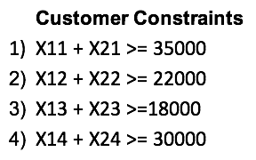

# Problem 

Let’s say the company is Crocs which supplies only footwear, and the customers here are its distributors who need these crocs in bulk. 
The products to be supplied are uniform in nature.

1. The cost of shipping matrix for Warehouse i to Customer j is as follows. Each value can also be represented as Cij 
suggesting Cost C to ship from Warehouse i to Customer j.

2. The customer demands and the warehouse availability is as follows.

# Formulation the problem 
Let’s start formulating the problem using mathematical equations. We need to identify 3 main components of our LP namely :-

#### 1. Decision Variables
We will define our decision variable as Xij which basically tells that X products should be delivered from Warehouse
i to Customer j.

#### 2. Objective Function
Our objective function is defined as the overall cost of shipping these products and we need to minimize this overall 
cost. Hence, objective function is defined as :

#### 3 Constraints
With respect to the given problem we will have 2 major 
types of constraints:-

3.1) Warehouse Constraints or Supply Constraints: These constraints basically say that the overall supply that 
will be done by each warehouse across all the 4 customers is less than or equal to the maximum availability/capacity 
of that warehouse.

Supply Constraints
3.2) Customer Constraints or Demand Constraints: These constraints basically say that for each customer the supply
done across the 2 warehouses should be equal (or greater than equal to) to the demand of that customer. 
We can use ≥ instead of = because our objective function would always try to minimize cost and hence never supply 
more than needed. This is done because in some optimization problems we may not reach to a feasible solution 
with strict equality constraints. Although, that is not the case here.

